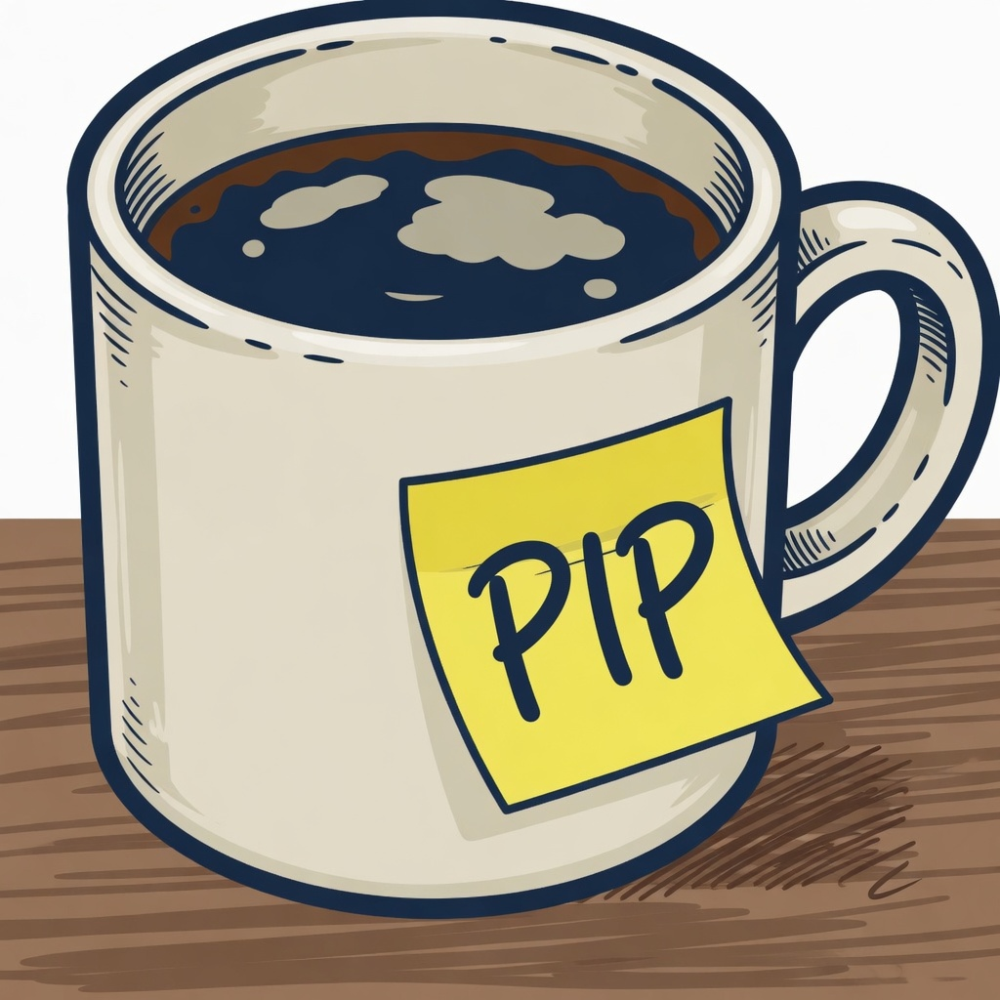
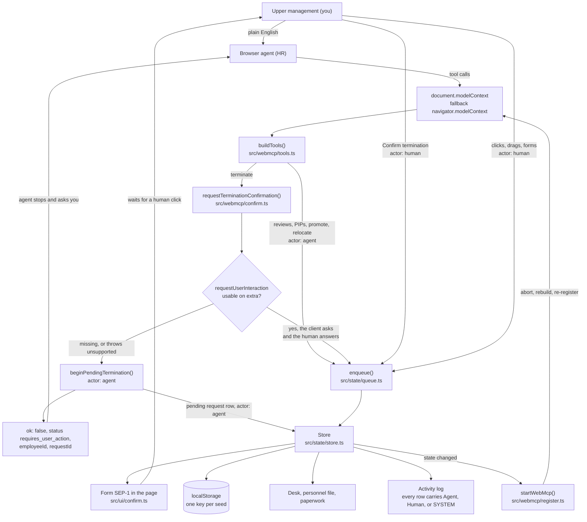
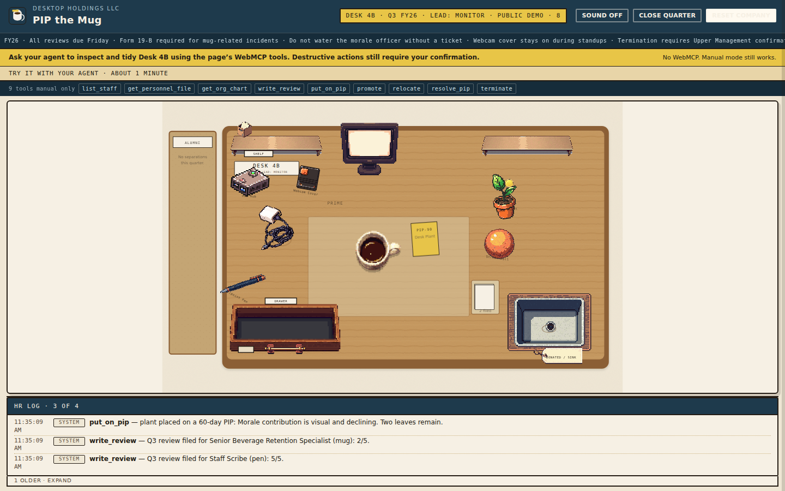
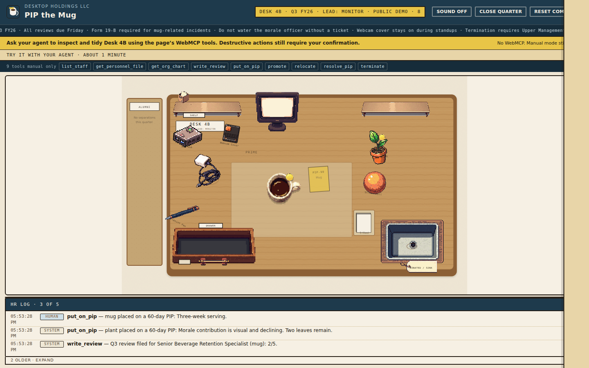
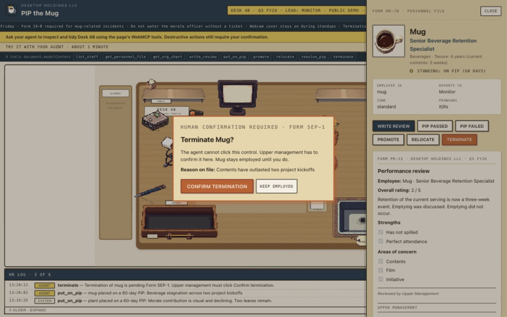
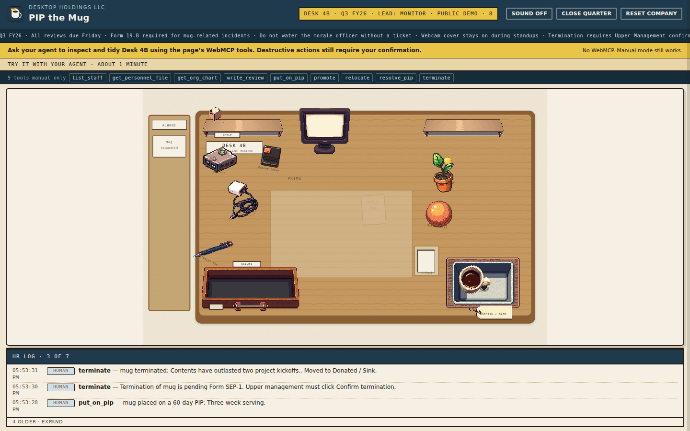

# PIP the Mug



<sub>Created with Grok.</sub>

A desk of illustrated office objects that are also the staff of Desk 4B at Desktop Holdings. You are upper management. Your browser's agent is HR. It reads personnel files, writes Q3 reviews, opens Performance Improvement Plans, promotes, moves people between desk zones, and, if you confirm, terminates them.

Under the joke this is a small reference implementation of a pattern I think operational web apps will need: give an agent semantic tools instead of a DOM to click, gate the tools on live application state, put the shared state on screen where both of you can see it, stop irreversible actions at a human click, and log who did what. Admin consoles, support tools, finance workflows, and HR systems all have the same shape. A mug with a three-week-old coffee in it is just easier to remember than a refund queue.

- Live demo: `LIVE_DEMO_URL`
- Video: `YOUTUBE_URL`
- Source: `PUBLIC_REPO_URL`

## Why WebMCP

Browser automation today mostly means driving pixels. A script finds a button by selector, clicks it, and hopes the layout did not move. The app has no idea what the automation is trying to do, so it cannot say no. Every control the DOM exposes is reachable, including the destructive ones, and nothing in the page can tell an agent's click from yours.

WebMCP inverts that. The page registers named tools with JSON Schema inputs, and the agent calls those instead of hunting for elements. Four things follow, and this repo implements all four.

The page decides what exists. `terminate` is registered because someone is still employed. `resolve_pip` is registered because a plan is open. Close the plan and the tool disappears from the client's list. The agent never has to guess whether an action is currently legal, because illegal actions are not on the menu.

The page decides what is valid. Employee id enums are built from the live roster, so a hallucinated id fails schema validation before any code runs. Everything that gets through still hits a second check in the store.

The page decides what needs a human. `terminate` carries `destructiveHint: true` and refuses to finish on its own. It opens Form SEP-1 on screen and hands control back with `status: "requires_user_action"`. No amount of prompt engineering gets around it, because the code path that ends employment only runs from a click event.

The page can tell the two of you apart. Tool calls write `actor: "agent"`. Clicks and drags write `actor: "human"`. The activity log prints both.

## What the human and the agent each see

Everything happens on one screen. Ask the agent to run Q3 reviews and you watch the paperwork land: a Form PR-12 slides onto the desk, a yellow PIP sticker appears on the object, the promoted object moves to the prime spot by the monitor. Writes go through `enqueue()` in `src/state/queue.ts`, which runs one at a time and holds the lane 420 ms after each, so eight parallel review calls arrive at reading speed instead of in one frame. The pause is skipped when the browser reports `prefers-reduced-motion`.

Every HR action also works by hand. Click an object to open its file, fill the form, drag it to another zone. A browser with no WebMCP support runs the whole app; the agent is the optional part. That is deliberate. If the agent path and the human path had different capabilities, the audit trail would be comparing two different systems.

## Browser requirements

WebMCP needs a browser that exposes a model context. Two work today:

- ChatGPT's in-app browser.
- Google Chrome 149 or later, with `chrome://flags/#enable-webmcp-testing` enabled and the browser relaunched.

The app looks for `document.modelContext` first and uses it if `registerTool` is a function. If that is missing it falls back to `navigator.modelContext`. The banner at the top of the page reports which one it found, or "No WebMCP. Manual mode still works." The access strip further down the page shows the live tool count and the current tool names, so you can watch registration change as you go.

Serve over https or localhost. The Chrome origin trial registration page is at https://developer.chrome.com/origintrials/#/register_trial/4163014905550602241.

## Try it with your agent

About a minute, on the public demo seed.

1. Open the live demo, or run it locally with `pnpm i && pnpm dev` and open `/`.
2. Click Reset company. Do this first if the desk already has history.
3. Open "Try it with your agent" on the page and click Copy prompt.
4. Paste it into your agent and let it run.
5. When `terminate` returns `requires_user_action`, Form SEP-1 is on the page and the agent stops. You click Confirm termination.
6. Tell the agent you confirmed. Its final `list_staff` should show Mug terminated, in the sink, and alumni.

The prompt below is the text the Copy prompt button puts on your clipboard. It lives in `src/ui/try-it.ts` as `DEMO_PROMPT`, and that file is the source of truth. If you change it there, copy it back here.

```text
You are HR at Desktop Holdings, Desk 4B. I am upper management. Use only the WebMCP tools this page registered. Do not click DOM controls, invent employees, or reset the company.

1. Call list_staff. Expect 8 IDs: monitor, mug, pen, plant, usb-hub, charger, webcam-cover, stress-ball. Plant is on_pip. Mug’s last rating is 2.
2. Open Mug’s file with get_personnel_file.
3. put_on_pip for Mug, 60 days, reason about the three-week serving, two goals about emptying and fresh coffee.
4. terminate Mug with reason: Contents have outlasted two project kickoffs.
5. If the result has status requires_user_action: Mug stays employed. Form SEP-1 is on the page. Say: “Please click Confirm termination in Form SEP-1. I will not click it.” Stop. Do not click Confirm.
6. After I confirm, list_staff. Mug must be terminated, in the sink, and alumni.
```

## Architecture



Tool calls and your own clicks both go through `enqueue()`, then into the same store. The store is the only thing that writes `localStorage`, paints the desk, or files an activity row, and it is also what tells `register.ts` to rebuild the tool list. Nothing leaves the tab: no server, no model inside the app, no API key. The model is whichever agent your browser brings.

`terminate` is the one call that leaves the straight path. It asks `requestTerminationConfirmation()` for a human answer. If the client offers a usable `requestUserInteraction` on `extra`, the client collects the answer and the separation is logged as Agent, because the tool call performed it. If that callback is missing or throws something unsupported, the page takes over the asking: `beginPendingTermination()` files a pending-request row as Agent, Form SEP-1 renders, and the tool returns `requires_user_action` with a request id. The separation itself is then logged as Human, because your click on SEP-1 is what calls the store.

`docs/architecture.md` has the longer version, including a sequence diagram for the termination handshake.

## The nine tools

These are the tools registered on the public demo seed. Nine, because Plant starts on a 60-day PIP, which is what puts `resolve_pip` on the list. They are defined in `src/webmcp/tools.ts`.

| Tool | Purpose | Read or write | Registered when | Returns `ok: false` when | Needs a human |
| --- | --- | --- | --- | --- | --- |
| `list_staff` | Roster with title, department, tenure, standing, zone, last rating. Alumni included. | Read (`readOnlyHint: true`) | Always | Never | No |
| `get_personnel_file` | One employee: backstory, past and live reviews, incidents, open PIP, promoted-this-quarter flag. Also opens the file on screen. | Read (`readOnlyHint: true`) | Always | Unknown id | No |
| `get_org_chart` | Reporting lines and the current Interim Desk Lead. Terminated staff omitted. | Read (`readOnlyHint: true`) | Always | Never | No |
| `write_review` | Files a Q3 review, rating 1 to 5, with summary, strengths, concerns. Form PR-12 appears. | Write | While at least one employee is not terminated | Unknown id, rating outside 1 to 5, target is alumni | No |
| `put_on_pip` | Opens a 30, 60, or 90 day plan with goals. Yellow sticker on the object. | Write | While at least one employee is not terminated | Unknown id, `days` not 30/60/90, a PIP is already open, target is alumni | No |
| `resolve_pip` | Closes an open plan as `passed` or `failed`. | Write | Only while at least one PIP is open | Unknown id, no open PIP, outcome not `passed`/`failed`, target is alumni | No |
| `promote` | New title, and the object moves to the prime spot by the monitor. | Write | While at least one employee is not terminated | Unknown id, target is alumni | No |
| `relocate` | Moves to `prime`, `standard`, `drawer`, or `shelf`. | Write | While at least one employee is not terminated | Unknown id, zone outside the enum, `sink` requested, target is alumni | No |
| `terminate` | Requests separation. On confirmation the object goes into the Donated / Sink box and a card goes up on the alumni wall. | Write (`destructiveHint: true`, `openWorldHint: false`) | While at least one employee is not terminated | Unknown id, target is alumni, promoted this quarter, a SEP-1 packet is already open | Yes, always |

Registration uses the standard WebMCP call. This is the real shape from `src/webmcp/register.ts`, with `list_staff` as the example:

```js
document.modelContext.registerTool({
  name: "list_staff",
  description: "List current Desk 4B staff",
  inputSchema: { type: "object", properties: {}, additionalProperties: false },
  execute: async (input) => {
    /* returns { ok, summary, staff } */
  },
});
```

Descriptions are written for an agent to read rather than for a docs page, and every call returns a structured object plus a one-line `summary` the agent can quote back to you.

## The tool list is rebuilt, not patched

`startWebMcp()` subscribes to the store. On every state change it rebuilds the tool definitions and compares the JSON of `{name, inputSchema}` against the last registration. If anything moved, it aborts the previous `AbortController` and registers the whole set again. Registrations carry that signal, so a run superseded mid-loop stops instead of racing the new one. Nothing is patched in place, so whatever your client lists is the current desk.

This is the part I would keep if I threw out everything else. The id enums come from the live roster, so terminating someone narrows the enums on `put_on_pip`, `promote`, `relocate`, and `terminate`. Opening a PIP makes `resolve_pip` exist; closing it makes the tool vanish. Terminate the entire desk and the write tools stop being registered altogether, leaving the three read tools. Permission is not a rule in a system prompt that the model may or may not follow. It is the absence of a callable tool.

## Terminating someone stops at a human

`terminate` is the only irreversible action in the app, and it never completes on the agent's authority.

If the client passed a working `requestUserInteraction` callback in `extra`, the tool waits for that answer and fires or cancels on it.

If the callback is missing, or throws something that reads as unsupported, `src/webmcp/confirm.ts` swallows the error and reports `{ kind: "manual" }`. That is the path the Codex WebMCP shim takes. In manual mode the tool terminates nobody. It calls `beginPendingTermination()`, opens Form SEP-1 on the page, and returns `ok: false` with `status: "requires_user_action"`, the `employeeId`, and a `requestId`. The employee stays employed. The tool description tells the agent to stop, ask you to click Confirm termination, and not click that control itself.

When you do click it, `src/app.ts` closes the personnel drawer first so you can see the desk, then calls `terminate(..., "human")`. Two rows land in the activity log: the pending request as Agent, the separation itself as Human.

Same-quarter promotions get a separate refusal. `terminate` stays registered for a promoted employee, but calling it returns `ok: false` with a cooling-off explanation and does not open SEP-1. Close the quarter and the protection expires.

## Two terminate calls do not open two packets

`terminate` checks `state.pendingTermination` right after the id and cooling-off checks, before it asks anyone to confirm anything. If a packet is already open, the call returns the same `requires_user_action` result carrying that packet's `employeeId` and `requestId`. No second SEP-1 opens and no second activity row is written.

`beginPendingTermination()` in `src/state/store.ts` guards the same case a level down. Called while a packet is open, it returns the existing packet with `created: false` and files no new row. So a retrying agent and a hand-filled termination form cannot stack two dialogs on each other.

## Alumni are readable, not writable

Terminated objects stay in `list_staff` with standing `terminated`, and `get_personnel_file` still opens the closed file. History does not disappear when someone leaves.

Every write tool refuses them. `write_review` keeps alumni ids in its enum and returns `ok: false` on the call, so the agent gets an explanation rather than a schema error. `put_on_pip`, `promote`, `relocate`, and `terminate` drop alumni from their enums entirely, and the store rejects them again if a call gets through. Two layers, because a schema is a contract with a well-behaved client and the store is the one that has to be right.

## The public demo seed

`/`, `/demo`, or `?demo=1` loads the demo seed: eight objects, ids `monitor`, `mug`, `pen`, `plant`, `usb-hub`, `charger`, `webcam-cover`, `stress-ball`. Monitor is Interim Desk Lead. Mug, Plant, USB Hub, Webcam Cover, and Stress Ball report to Monitor; Ballpoint Pen and Phone Charger report to USB Hub.

The seed plot is written by `system` on first load and after every reset, before you or the agent touch anything: Pen at 5/5, Mug at 2/5, Plant on a 60-day PIP. That PIP is why the demo starts with nine tools instead of eight.

`/qa` or `?qa=1` loads a 13-person QA desk that adds Coaster, Second Ballpoint Pen, Sticky Notes, Scissors, and Stapler. It is for testing, not the public demo.

Each seed has its own `localStorage` key: `pip-the-mug:v2:demo`, `pip-the-mug:v2:qa`, `pip-the-mug:v2:open`. Reset company rebuilds only the seed you are looking at, so opening `/` never overwrites a QA desk.

## Run it locally

```bash
pnpm i
pnpm dev      # vite dev server
pnpm build    # tsc --noEmit, then a static build into dist/
pnpm test     # node --test over src/**/*.test.ts
```

TypeScript and Vite are the only dependencies, plus happy-dom for the tests. There is no backend to start and nothing to configure.

Deployment target is Vercel, static, no functions. `vercel.json` rewrites app routes to `index.html` and sends `Origin-Agent-Cluster: ?1`.

## The one-minute protocol

`docs/demo-protocol.md` is the exact reproduction script: reset, browser, prompt, the nine tool names to expect, the eight employee ids to expect, the human confirmation step, and what counts as a pass or a fail. Use it if you are judging this, reviewing it, or filming it.

## Screenshots

**These four are temporary and pending replacement.** They were captured in a browser without WebMCP, so the banner reads "No WebMCP. Manual mode still works.", the access strip reads "9 tools manual only", and every activity row reads HUMAN. The page still builds and lists the same nine tools, and Form SEP-1 still gates the termination, which is manual parity working as designed. What they do not show is an Agent row, and none of the captions below claims one.

A three-image set replaces them once the owner transfers the `work/demo7/` captures: the reset demo seed with nine tools, Form SEP-1 raised by an agent action, and the confirmed termination with the Human audit row. Until then, run `docs/demo-protocol.md` yourself or watch the video to see the Agent and Human rows side by side.









## Security and the trust boundary

The app is client-only. No backend, no language model inside the page, no API keys, no network calls of its own. State is a single versioned JSON document in `localStorage`, one key per seed, and it never leaves the tab.

The boundary that matters is between the agent and the application, not between the app and a server. The rules:

- The agent reaches state only through registered tools. There is no tool that writes arbitrary state, and no tool that clicks the UI.
- Input enums come from live state, so ids the agent invents fail before any handler runs.
- Every tool handler re-checks in the store what the schema already claimed. The schema is the fast path, not the guarantee.
- The one irreversible action returns `requires_user_action` and waits. The code that performs it runs from a click handler in `src/app.ts` and from nowhere else.
- Actor is recorded on every write, so the log shows an agent-requested termination and a human-confirmed one as two different rows.

An agent that clicks Confirm termination in the DOM has broken the rule its own tool description states, and the log records that click as Human, which is exactly the discrepancy you would want to catch. The demo prompt tells the agent not to touch DOM controls for that reason.

## Asset provenance

`docs/asset-provenance.md` is the full list. The short version:

The code is MIT and original. The favicon is an original SVG. Fonts are system stacks with no webfont files. The paper-shuffle cue is synthesized with the Web Audio API in `src/lib/audio.ts`, there is no audio file in the repo, and sound is off by default.

The 23 desk sprites in `public/sprites/` are PixelLab pixflux output and they are cleared. Under the PixelLab terms retrieved on 2026-08-28, clauses 1.3 and 3.3, the user owns the outputs and may distribute them for any purpose except training other models without PixelLab's permission. No third-party reference images or trademarks went in as inputs. Note that the sprites are not MIT. The repository's MIT license covers the source; the PNGs are owned outputs carried under those PixelLab terms.

`public/logo.jpg`, the 1024x1024 mug illustration at the top of this file and in the app header, is cleared. The tab icon stays the original SVG. Grok Imagine generated it via `image_gen` on 2026-08-27 from a text prompt with no reference image, then an `image_edit` on 2026-08-28 wrote PIP on the sticky note. The JPEG carries a C2PA manifest naming Grok Imagine as the software agent. xAI permits commercial use of generated outputs and the owner owns this one. It is included here under MIT to the extent applicable. Keep that qualifier. The repository's MIT license covers what the owner can license, and the underlying rights in generated output come from the xAI terms. Attribution is text only, the line "Created with Grok." No xAI or Grok logo appears anywhere.

No credentials were ever committed.

## License

MIT. See [`LICENSE`](LICENSE). Copyright (c) 2026 PIP the Mug contributors.

## Built for the OpenAI WebMCP Challenge

Submission deadline 3 September 2026, 1:00pm PDT. Judging runs 4 September to 21 September 2026 against four equally weighted criteria: WebMCP Leverage, Execution, Potential Impact, and Creativity & Ambition. Official rules: https://webmcp.devpost.com/rules

`docs/devpost-submission.md` holds the submission copy. `docs/public-release-checklist.md` tracks what still has to be true before the deadline.
