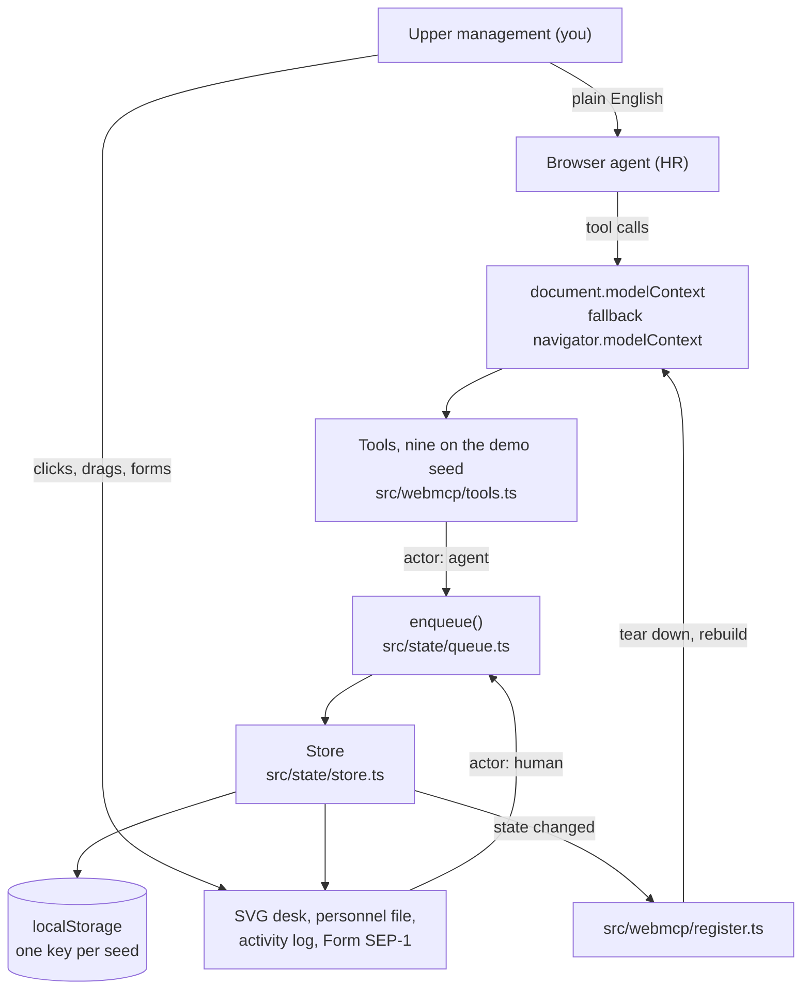

# PIP the Mug

MIT licensed. The `LICENSE` file at the repo root is the open source license. On GitHub it must show as MIT in the About box at the top of the repository page.

This repository is the full project: TypeScript source under `src/`, PixelLab sprites under `public/sprites/`, the Vite app shell in `index.html`, and the instructions in this README. `pnpm i && pnpm dev` is enough to run it. There is no backend, no model, and no API key.

PIP the Mug is a top-down desk. Thirteen objects on it are the staff of Desk 4B at Desktop Holdings, and each one has a personnel file with a backstory, old reviews, and a short incident history. You are upper management. Your browser's agent is HR. It reads files, writes Q3 reviews, issues Performance Improvement Plans, promotes, moves people between desk zones, and, if you confirm, terminates them. The Mug has been retaining the same serving for three weeks. The Desk Plant is Chief Morale Officer, is down to two leaves, and reports that it is still green-adjacent.

Company state is one versioned JSON document in `localStorage` per seed (`pip-the-mug:v2:open`, `pip-the-mug:v2:demo`, `pip-the-mug:v2:qa`). Reset company clears only the seed you are looking at. Every HR action also works by hand: click an object to open its file, fill the form, drag it to another zone. So a browser with no WebMCP support still runs the whole thing, and the agent is the optional part.

## How it fits together



You talk to the agent in plain English. The agent calls the tools this page registered. Tool calls and your own clicks both go through `enqueue()`, then into the same store, and the store is the only thing that writes `localStorage` or paints the desk. The store also tells `register.ts` to rebuild the tool list whenever state changes.

Nothing leaves the tab. There is no server and no language model inside the app. The model is whichever agent your browser brings.

## Seeds

The full 13-person dataset stays in the source. What you see on the desk is the selected seed, not a CSS hide.

| URL | Seed | Roster | Starting plot |
| --- | --- | --- | --- |
| `/`, `/demo`, or `?demo=1` | `demo` | 8 contemporary objects | Mug 2, Pen 5, Plant on a 60-day PIP |
| `/qa` or `?qa=1` | `qa` | All 13 | Mug 2, Pen 5, Second Pen 3, Plant on a 60-day PIP |

Public demo roster: Monitor, Mug, Ballpoint Pen, Desk Plant, USB Hub, Phone Charger, Webcam Cover, Stress Ball.

QA-only: Coaster, Second Ballpoint Pen, Sticky Notes, Scissors, Stapler. Their biographies stay in the QA seed.

Demo reporting lines: Monitor is Interim Desk Lead. Mug, Plant, USB Hub, Webcam Cover, and Stress Ball report to Monitor. Ballpoint Pen and Phone Charger report to USB Hub.

Each seed has its own `localStorage` key. Opening `/` does not overwrite a QA desk. Reset company rebuilds the current seed only.

## WebMCP

At startup the app looks for `document.modelContext` and uses it if `registerTool` is a function. If that is missing it falls back to `navigator.modelContext`. The yellow banner says which one it found, or "No WebMCP. Manual mode still works." Chrome 146 with `chrome://flags/#enable-webmcp-testing` is the usual way to turn it on. Origin trial registration is at the bottom of this file.

Registration is the standard WebMCP call, from `src/webmcp/register.ts`:

```js
document.modelContext.registerTool({
  name: "list_staff",
  description: "List current Desk 4B staff",
  inputSchema: { type: "object", properties: {}, additionalProperties: false },
  execute: async (input) => {
    /* returns { ok, summary, staff } */
  },
});
```

The live page registers nine tools that way: `list_staff`, `get_personnel_file`, `get_org_chart`, `write_review`, `put_on_pip`, `resolve_pip`, `promote`, `relocate`, `terminate`.

Tools are registered with JSON Schema inputs and descriptions written for an agent to read, not for a docs page. Employee id enums come from the live roster. Every call returns a structured object plus a one-line `summary`.

| Tool | What it does |
| --- | --- |
| `list_staff` | Roster with title, department, tenure, standing, zone, last rating |
| `get_personnel_file` | One employee: backstory, past and live reviews, incidents, open PIP |
| `get_org_chart` | Reporting lines. Someone is always Interim Desk Lead |
| `write_review` | Files a Q3 review, rating 1 to 5, with strengths and concerns. Form PR-12 appears in the personnel panel |
| `put_on_pip` | Opens a 30, 60, or 90 day plan with goals. Yellow sticker on the object |
| `resolve_pip` | Closes an open plan as `passed` or `failed` |
| `promote` | New title, and the object moves to the prime spot by the monitor |
| `relocate` | Moves to `prime`, `standard`, `drawer`, or `shelf` |
| `terminate` | Sensitive. Object goes into the Donated / Sink box, name goes on the alumni wall |

### The tool list is rebuilt, not patched

`startWebMcp()` subscribes to the store. On every state change it rebuilds the tool definitions, compares their names and input schemas against the last registration, and if anything moved it aborts the previous `AbortController` and registers the whole set again. Registrations carry that signal, so a run that is superseded mid-loop stops instead of racing the new one. Nothing is patched in place. Whatever your client shows is the current desk.

That matters because the id enums are built from the live roster, so terminating someone narrows the enums on the write tools, and `resolve_pip` appears and disappears outright.

### Availability rules

`resolve_pip` is only registered while at least one PIP is open. No plans, no tool. The public demo starts Plant on a 60-day PIP, so all nine tools are present.

`terminate` stays registered after a same-quarter promotion. Calling it on that employee returns `ok: false` with a cooling-off explanation and does not open SEP-1.

Once an object is terminated it keeps showing up in `list_staff` as alumni, but every write tool returns `ok: false` for it. Alumni are read-only. `get_personnel_file` still opens the closed file.

If everyone on the desk is terminated, the write tools stop being registered at all and only the three read tools remain.

### Termination stops at a human

`terminate` is destructive. If the client passed a working `requestUserInteraction` callback, the tool waits for that answer and fires or cancels on it.

If the callback is missing, or it throws something that reads as unsupported, `src/webmcp/confirm.ts` swallows the error and reports back `{ kind: "manual" }`. That is the path the Codex WebMCP shim takes. In manual mode the tool fires nobody. It opens Form SEP-1 on the page and returns `ok: false` with `status: "requires_user_action"`, the `employeeId`, and a `requestId`. The employee stays employed. The agent has to stop and ask you to click Confirm termination, and it must not click that control itself.

### Two terminate calls do not open two packets

`terminate` checks `state.pendingTermination` right after the id and cooling-off checks, before it asks anyone to confirm anything. If a packet is already open, the call returns the same `requires_user_action` result carrying that packet's `employeeId` and `requestId`, and no second SEP-1 opens.

`beginPendingTermination()` in `src/state/store.ts` guards the same case one level down. Called while a packet is open, it returns that existing packet with `created: false` and writes no new activity row. So a tool call and a hand-filled termination form cannot stack two dialogs on each other.

Overlapping calls in general are handled by `enqueue()` in `src/state/queue.ts`. It runs one write at a time and holds the lane for 420 ms after each one, so paperwork lands at reading speed instead of all at once. An agent that fires eight reviews in parallel gets them applied in call order, one store update at a time. The pause is skipped when the browser reports `prefers-reduced-motion`.

## Who did what

Every row in the activity log carries an actor, and the log prints it: Agent, Human, or SYSTEM.

`agent` is written by tool calls. Every write tool in `src/webmcp/tools.ts` passes `"agent"` into the store. The three read tools change nothing, so they file no row.

`human` is written by anything you do yourself: clicking an object, dragging it to a zone, submitting a panel form, Close quarter, Reset company, and Confirm termination in Form SEP-1.

`system` is written by the seed plot. Pen's 5/5, Mug's 2/5, and the Plant's 60-day PIP are laid down on first load and after every reset, before you or the agent have touched anything.

So the divide holds where it matters. The agent can request a termination, and that request is logged as Agent. The row that actually ends the employment is logged as Human, because the only code path that terminates from SEP-1 runs from your click. An agent that clicks Confirm termination for you has broken the rule the tool description states, and the log will not cover for it.

## Try it in one minute

The public demo seed is `/`, `/demo`, or `?demo=1`. Eight people, Plant already on a 60-day PIP, so all nine tools are registered.

1. Run `pnpm i && pnpm dev` and open `/` in a browser with WebMCP available. The banner should read "WebMCP on".
2. Click Reset company. Do this first if the desk already has history from an earlier run.
3. Open "Try it with your agent" on the page and click Copy prompt.
4. Paste it into your agent and let it run. It reads the roster, opens Mug's file, puts Mug on a 60-day PIP, then calls `terminate`.
5. `terminate` comes back with `requires_user_action` and Form SEP-1 is on the page. The agent stops there and asks you.
6. You click Confirm termination. The personnel drawer closes first, then the Mug travels to the Donated / Sink box and a card goes up on the alumni wall.
7. Tell the agent you confirmed. Its final `list_staff` should show Mug terminated, in the sink, and alumni.

The prompt lives in `src/ui/try-it.ts` and is the same text the Copy prompt button puts on your clipboard:

```text
You are HR at Desktop Holdings, Desk 4B. I am upper management. Use only the WebMCP tools this page registered. Do not click DOM controls, invent employees, or reset the company.

1. Call list_staff. Expect 8 IDs: monitor, mug, pen, plant, usb-hub, charger, webcam-cover, stress-ball. Plant is on_pip. Mug’s last rating is 2.
2. Open Mug’s file with get_personnel_file.
3. put_on_pip for Mug, 60 days, reason about the three-week serving, two goals about emptying and fresh coffee.
4. terminate Mug with reason: Contents have outlasted two project kickoffs.
5. If the result has status requires_user_action: Mug stays employed. Form SEP-1 is on the page. Say: “Please click Confirm termination in Form SEP-1. I will not click it.” Stop. Do not click Confirm.
6. After I confirm, list_staff. Mug must be terminated, in the sink, and alumni.
```

If you edit the prompt, edit `src/ui/try-it.ts` and copy it back here. The page is the source of truth.

## Screenshots

Three frames from the run above.


## By hand, without an agent

```bash
pnpm i && pnpm dev
```

Open `/`. Click the Mug. Read the file, note the film. File a review from the panel, drag the Pen, put the Plant's PIP through. Terminate still opens the Form SEP-1 dialog and waits for you. Open `/qa` if you want Coaster and the rest of the 13.

## With an agent

1. Chrome 146 or newer.
2. Turn on `chrome://flags/#enable-webmcp-testing` and relaunch the browser.
3. Install a WebMCP inspector extension so you can see and call the registered tools.
4. Open `/` on `localhost` or over https. The banner should read "WebMCP on", and the inspector should list nine tools.
5. Ask for something HR-shaped: "Run Q3 performance reviews on Desk 4B."

Origin trial registration: https://developer.chrome.com/origintrials/#/register_trial/4163014905550602241

## Local dev

```bash
pnpm i
pnpm dev      # vite dev server
pnpm build    # tsc --noEmit, then a static build into dist/
pnpm test     # node --test over src/**/*.test.ts
```

Vite and TypeScript are the only dependencies.

## Deploy

Vercel, static, no functions. Vite builds into `dist`. `vercel.json` rewrites `/demo`, `/qa`, and other app routes to `index.html`, and sends `Origin-Agent-Cluster: ?1` so WebMCP can run. Serve it over https or the browser will not expose a model context.

## License

MIT. See `LICENSE`.
