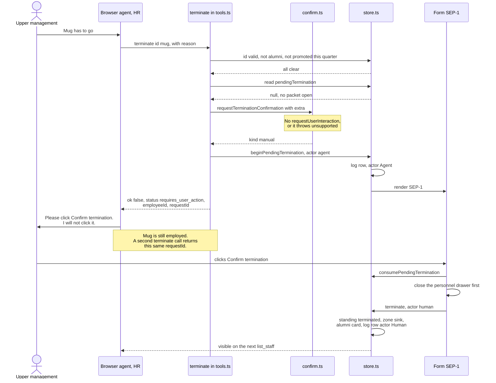

# Architecture

How PIP the Mug is put together, for anyone reading the source or copying the pattern. The short version is in the [README](../README.md). This is the part that matters if you want to build the same guarantees into a real admin console.

Nothing here needs a server. The app is client-only TypeScript compiled by Vite, with no backend, no language model inside the page, and no API keys. The model is whichever agent the browser brings.

## The state model

One store, `src/state/store.ts`, holds a single `CompanyState` object.

```ts
interface CompanyState {
  version: number;                 // STATE_VERSION, currently 2
  seed: DeskSeed;                  // "open" | "demo" | "qa"
  quarter: number;                 // starts at 3
  deskLeadId: EmployeeId;          // whoever is Interim Desk Lead
  soundEnabled: boolean;           // off by default
  employees: Partial<Record<EmployeeId, EmployeeRuntime>>;
  alumni: TerminationRecord[];
  activity: ActivityEntry[];       // capped at 80 rows, newest first
  papers: PaperItem[];             // capped at 12
  pendingTermination: PendingTermination | null;
}
```

Every mutation replaces `state` with a new object and calls `emit()`, which writes `localStorage` and then notifies subscribers. The UI is a subscriber. So is `startWebMcp()`. There is no second source of truth, and no code path that paints the desk without going through the store.

Persistence is one versioned JSON document per seed, under `pip-the-mug:v2:demo`, `pip-the-mug:v2:qa`, and `pip-the-mug:v2:open`. A `localStorage` write that throws, which is what private mode does, is swallowed; the app keeps running from memory. On load, `clipToRoster()` drops anything that is not in the current seed's roster, including stale activity rows and a `pendingTermination` for someone who is not on this desk. Reset company rebuilds the current seed only.

Seeds are picked from the URL by `detectSeed()` in `src/data/seeds.ts`. `/qa` or `?qa=1` gives the 13-person QA desk. Everything else gives the 8-person demo desk. The `open` seed exists in the type and has its own storage key, but no URL selects it; a v1 desk migrates into it.

After a fresh load or a reset, `applySeedPlot()` writes the starting story with `actor: "system"`: Pen at 5/5, Mug at 2/5, Plant on a 60-day PIP. Those rows are in the log before you or the agent have done anything, which is the point. You can tell seeded history from anything either of you did.

## Registration lifecycle

`src/webmcp/detect.ts` looks for `document.modelContext` and returns it if `registerTool` is a function, then falls back to `navigator.modelContext`, then reports nothing available. The banner shows which branch won.

`src/webmcp/register.ts` owns registration. `startWebMcp()` subscribes to the store and calls `syncWebMcpTools()` on every state change. That function:

1. Builds the current tool set with `buildTools()`.
2. Computes a signature: `JSON.stringify` of each tool's `{name, title, description, inputSchema, annotations}`.
3. Returns immediately if the signature is unchanged and a registration is live.
4. Bumps a `generation` counter, aborts the previous `AbortController`, and creates a new one.
5. Yields a macrotask, then bails if a newer generation started while it waited.
6. Registers every tool, passing `{ signal }`, and bails between tools if the controller aborted or the generation moved.

The whole set is torn down and rebuilt. Nothing is patched in place. Two consequences worth naming: what the client lists always matches the desk, and a sync superseded mid-loop stops rather than interleaving with its replacement. A `registerTool` that throws for reasons other than abort is logged with `console.warn` and the loop continues, so one bad tool cannot take down the other eight.

The signature covers every registered metadata field except the execute callback. A quarter change therefore refreshes the `write_review` description even when names and schemas stay unchanged. State updates that leave all registered metadata unchanged do not trigger another registration.

### What changes the signature

`buildTools()` in `src/webmcp/tools.ts` reads the store each time it runs.

The three read tools, `list_staff`, `get_personnel_file`, and `get_org_chart`, are always registered and carry `readOnlyHint: true` and `untrustedContentHint: true`. Their results can contain titles, reviews, PIP text, or reporting data previously written by a human or agent. `get_personnel_file` changes no state, but it does open the file panel on screen, which is how you watch the agent read.

`write_review`, `put_on_pip`, `promote`, `relocate`, and `terminate` are appended only if at least one employee is not terminated. Terminate the whole desk and `buildTools()` returns after the three reads. There is no write tool left to call.

`resolve_pip` is appended only while `staffOnPip()` is non-empty, and its `id` enum lists exactly those employees. Open a PIP and the tool appears. Close it and the tool is gone from the client's list on the next store update.

Id enums come from live state. `put_on_pip`, `promote`, `relocate`, and `terminate` use `LIVE_ENUM`, the non-terminated employees. `get_personnel_file` and `write_review` use `ID_ENUM`, the full roster including alumni, so that reading a closed file works and reviewing an alumnus gets a spoken refusal instead of a schema error. Terminating someone shrinks four enums at once, which changes the signature, which triggers a full re-registration.

## Write validation

Every write is checked twice, and I would not trust either layer alone.

The schema is the first pass. Enums, `minimum`/`maximum` on rating, `enum: [30, 60, 90]` on PIP length, `required`, and `additionalProperties: false` on every tool. A well-behaved client rejects a bad call before it reaches the page.

The handler is the second pass. `asId()` re-resolves the id against `getState().employees` and returns null for anything not on this desk. Rating is re-checked against `[1,2,3,4,5]`. `days` is re-checked. `zone` is re-checked against the four legal zones, and `sink` is refused with a pointer to `terminate`.

The store is the third pass, and the one that actually enforces the rules. `writeReview`, `putOnPip`, `resolvePip`, `promote`, `relocate`, and `terminate` each re-check standing before mutating. `putOnPip` refuses a second open plan. `resolvePip` refuses when there is no open plan. `canTerminate()` refuses a same-quarter promotion. Every refusal is `{ ok: false, summary }` with a sentence explaining why, because an agent that gets a reason can adapt, and an agent that gets a bare failure retries.

`relocate` also refuses `sink` at the store level even though `sink` is not in the schema enum. The UI drag path calls the same function.

### Pacing

`enqueue()` in `src/state/queue.ts` serializes writes. One runs at a time; the rest queue in call order and resume in that order. After each write the lane is held for 420 ms so paperwork lands at reading speed, unless the browser reports `prefers-reduced-motion`, in which case the pause is skipped entirely.

Both actors use it. Tool calls wrap their store call in `enqueue()`, and so do the UI handlers in `src/app.ts`. An agent firing eight reviews in parallel gets them applied one at a time, in call order, with the desk redrawing between each.

## The interaction fallback

`src/webmcp/confirm.ts` is 32 lines and carries the whole human-in-the-loop guarantee.

`requestTerminationConfirmation(options, message)` looks for a `requestUserInteraction` function on the `extra` argument the client passed to `execute`. If it finds one, it calls it and returns `{ kind: "resolved", confirmed }`.

If the callback is absent, the function returns `{ kind: "manual" }`.

If the callback exists but throws, `isUnsupportedUserInteraction()` tests the error text against `/not supported|unsupported|is not a function|WebMCP shim/i`. A match is swallowed and downgraded to `{ kind: "manual" }`. That is the path the Codex WebMCP shim takes. Anything else rethrows, because an error that is not about missing support is a real error and hiding it would be worse than failing.

Manual mode does not mean the termination happens. It means the page takes over the asking. `terminate` calls `beginPendingTermination()`, Form SEP-1 renders on the page, and the tool returns `ok: false` with `status: "requires_user_action"`, `action: "confirm_termination_in_page"`, the `employeeId`, and a `requestId`. The employee is still employed. The tool description instructs the agent to stop, ask the user, and not click the control.

Both branches wait for a confirmation response before separation. A supporting client owns the `requestUserInteraction` prompt. The in-page SEP-1 path preserves the WebMCP stop and handoff on clients without that callback, but it relies on the agent following the handoff rather than providing a security boundary against separate DOM automation.

### The termination handshake



## The duplicate-request guard

Two levels, because there are two ways to get here.

In `terminate`, the `state.pendingTermination` check runs after the id and cooling-off checks and before anything asks for confirmation. If a packet is open, the call returns the existing packet's `employeeId` and `requestId` in a `requires_user_action` result. No second dialog, no second log row, and no second call into `requestUserInteraction`. An agent that retries on the first `ok: false` gets the same request id back and can tell it is the same request.

In `beginPendingTermination()`, the same case is caught a level down. Called while a packet is open, it returns `{ created: false, pending }` with the existing packet, calls `emit()` so the UI redraws, and writes nothing to the activity log. This is what stops a tool call and a hand-filled termination form from stacking two dialogs, since `src/app.ts` calls the same function when you submit the termination form by hand.

`consumePendingTermination()` clears the packet and hands it back, and only the confirm handler calls it. `clearPendingTermination()` is the cancel path. `terminate()` also nulls `pendingTermination` as part of the successful mutation, so a packet cannot outlive its own resolution.

## Audit actors

Every activity row carries an actor, and the log prints it.

`agent` is written by tool calls. Each write tool passes the string `"agent"` into the store. The three read tools mutate nothing and file no rows, so reading a file does not pollute the log.

`human` is written by anything you do yourself: clicking an object, dragging it to a zone, submitting a panel form, Close quarter, Reset company, and Confirm termination in Form SEP-1.

`system` is written by `applySeedPlot()` only. Pen's 5/5, Mug's 2/5, and the Plant's PIP are seeded history, not anyone's decision.

The split holds at the one place it has to. The agent can request a termination, and that request is logged as Agent. The row that ends the employment is logged as Human, because the only code path calling `terminate(..., "human")` runs from the click handler in `src/app.ts`. An agent that clicks Confirm termination in the DOM has broken the rule its tool description states, and the log will show a Human row that no human produced. The demo prompt tells the agent not to click DOM controls for that reason, and the check is worth running on any agent you are evaluating.

## File map

| Path | What lives there |
| --- | --- |
| `src/webmcp/detect.ts` | Finds `document.modelContext` or `navigator.modelContext` |
| `src/webmcp/register.ts` | Signature diffing, `AbortController` teardown, re-registration |
| `src/webmcp/tools.ts` | The nine tool definitions and their handlers |
| `src/webmcp/confirm.ts` | `requestUserInteraction` with the manual fallback |
| `src/state/store.ts` | State, mutations, actor logging, persistence |
| `src/state/queue.ts` | `enqueue()`, one write at a time, 420 ms pacing |
| `src/state/org.ts` | Roster rows and the org chart |
| `src/state/layout.ts` | Zone slot assignment |
| `src/data/seeds.ts` | Rosters, demo layout, seed detection, storage keys |
| `src/data/staff.ts` | The 13 personnel records |
| `src/ui/` | Desk, personnel panel, activity log, Form SEP-1, try-it guide |
| `src/app.ts` | Event handlers, human-actor writes, confirm handler |
